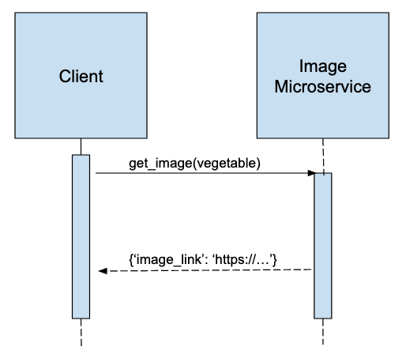

# Image Webscrape Microservice
This microservice will webscrape google images given a search parameter and return a link to an image

## Instructions

1. Download the repository locally
2. If not already installed, install python3, requests, bs4, flask
   - Recommend using a [virtual environment](https://realpython.com/python-virtual-environments-a-primer/) to separate installations from system installations
   - ``` pip install requests beautifulsoup4 Flask```
3. Navigate to main.py and either run `python3 main.py` or `flask run`
<br />
   Congratulations the microservice is now running!

## Sending a request to the microservice (via HTTP)

GET requests from the client are sent to `localhost:105/get_image/<vegetable>` where \<vegetable> is the vegetable you'd like an image for

## Receiving a response from the microservice (via HTTP)

The response from the microservice is a JSON object `{"image-link": <link_to_google_image>}` where <link_to_google_image> is a link to a google image associated with that vegetable searched

Note: In the event that the vegetable was unable to be found via google image search, a string response of `Sorry, unable to find image associated with {vegetable}" will be returned.`



## Stopping 
   To stop the microservice, press `Ctrl + C`
